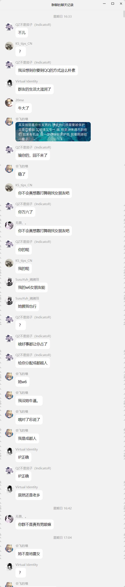
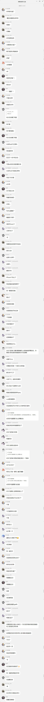
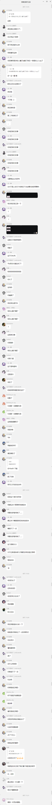

# 会飞的墙

## 本篇

<!-- START GENERATE -->
<picture>
  <source srcset="_media/avif/1.avif" type="image/avif">
  <source srcset="_media/webp/1.webp" type="image/webp">
  
</picture>
<picture>
  <source srcset="_media/avif/2.avif" type="image/avif">
  <source srcset="_media/webp/2.webp" type="image/webp">
  
</picture>
<picture>
  <source srcset="_media/avif/3.avif" type="image/avif">
  <source srcset="_media/webp/3.webp" type="image/webp">
  
</picture>
<picture>
  <source srcset="_media/avif/4.avif" type="image/avif">
  <source srcset="_media/webp/4.webp" type="image/webp">
  
</picture>
<picture>
  <source srcset="_media/avif/5.avif" type="image/avif">
  <source srcset="_media/webp/5.webp" type="image/webp">
  
</picture>
<picture>
  <source srcset="_media/avif/6.avif" type="image/avif">
  <source srcset="_media/webp/6.webp" type="image/webp">
  
</picture>
<picture>
  <source srcset="_media/avif/7.avif" type="image/avif">
  <source srcset="_media/webp/7.webp" type="image/webp">
  
</picture>
<picture>
  <source srcset="_media/avif/8.avif" type="image/avif">
  <source srcset="_media/webp/8.webp" type="image/webp">
  
</picture>
<picture>
  <source srcset="_media/avif/9.avif" type="image/avif">
  <source srcset="_media/webp/9.webp" type="image/webp">
  
</picture>
<picture>
  <source srcset="_media/avif/10.avif" type="image/avif">
  <source srcset="_media/webp/10.webp" type="image/webp">
  
</picture>
<picture>
  <source srcset="_media/avif/11.avif" type="image/avif">
  <source srcset="_media/webp/11.webp" type="image/webp">
  
</picture>
<picture>
  <source srcset="_media/avif/12.avif" type="image/avif">
  <source srcset="_media/webp/12.webp" type="image/webp">
  
</picture>
<picture>
  <source srcset="_media/avif/13.avif" type="image/avif">
  <source srcset="_media/webp/13.webp" type="image/webp">
  
</picture>
<picture>
  <source srcset="_media/avif/14.avif" type="image/avif">
  <source srcset="_media/webp/14.webp" type="image/webp">
  
</picture>
<picture>
  <source srcset="_media/avif/15.avif" type="image/avif">
  <source srcset="_media/webp/15.webp" type="image/webp">
  
</picture>
<picture>
  <source srcset="_media/avif/16.avif" type="image/avif">
  <source srcset="_media/webp/16.webp" type="image/webp">
  
</picture>
<picture>
  <source srcset="_media/avif/17.avif" type="image/avif">
  <source srcset="_media/webp/17.webp" type="image/webp">
  
</picture>
<picture>
  <source srcset="_media/avif/18.avif" type="image/avif">
  <source srcset="_media/webp/18.webp" type="image/webp">
  
</picture>
<picture>
  <source srcset="_media/avif/19.avif" type="image/avif">
  <source srcset="_media/webp/19.webp" type="image/webp">
  
</picture>
<picture>
  <source srcset="_media/avif/20.avif" type="image/avif">
  <source srcset="_media/webp/20.webp" type="image/webp">
  
</picture>
<picture>
  <source srcset="_media/avif/21.avif" type="image/avif">
  <source srcset="_media/webp/21.webp" type="image/webp">
  
</picture>
<picture>
  <source srcset="_media/avif/22.avif" type="image/avif">
  <source srcset="_media/webp/22.webp" type="image/webp">
  
</picture>
<picture>
  <source srcset="_media/avif/23.avif" type="image/avif">
  <source srcset="_media/webp/23.webp" type="image/webp">
  
</picture>
<!-- END GENERATE -->

---

## DLC

